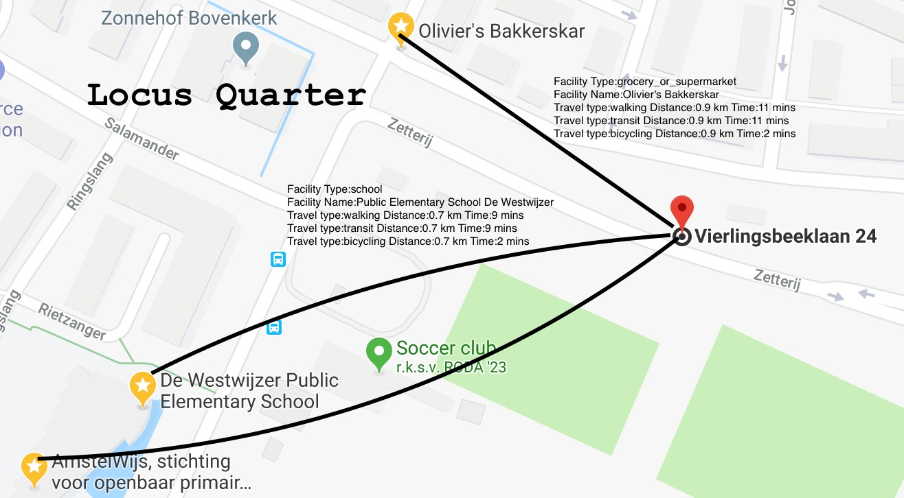

# Why did I create Locus Quarter and why it should help you

I was actively searching for houses, to buy one. 10's of houses on various house search websites like funda.nl.
When we search for a house/property, we also try to find out what are the things near that property, that are important to us. Like: Grocery, Bus stop, School etc.
These preferences, vary from person to person.

Every time, I liked a house, I had to open Google Maps, put in the house address, search for places around me with different criteria, time taken to reach destinations, mode of transport and so on.

Well, I thought, as I know, what to search for, in the houses like price range, location etc and also places/amenities near by, can I not automate this?

Now, when I wake up in the morning, I have an email which
- Filtered list of the houses based on my criteria
- The places/amenities near that house
- Distance and travel time to those places in various modes of transport
- Distance to my office (a place where you go almost everyday)



**Table of contents**
- [Why did I create Locus Quarter and why it should help you](#why-did-i-create-locus-quarter-and-why-it-should-help-you)
- [Features of Locus Quarter](#features-of-locus-quarter)
- [Sources used](#sources-used)
- [Getting started](#getting-started)
    - [Get your Google API Key](#get-your-google-api-key)
    - [Configuring GMail for Email (Optional)](#configuring-gmail-for-email-optional)
    - [Baseline configuration before execution](#baseline-configuration-before-execution)
- [Execute & Enjoy the results](#execute--enjoy-the-results)
- [Sample Output](#sample-output)

# Features of Locus Quarter
+ **House/Property preferences**
  - Search houses in single/multiple localities
  - Price range for the localities
  - Can be easily enhanced to add/remove other search criterias as well

+ **Places/Amenities near the house/property**
  - Types of places/amenities like, school, supermarket [etc](https://developers.google.com/places/web-service/supported_types)
  - Mode of travel from the house to those places/amenities like, Cycling, Walking etc
  - Number of such amenities to be found

+ **Fixed Address (like Office) and mode of travel to those fixed addresses**
+ **Email on or off and Email to multiple receipients using GMail**

# Sources used
- RSS Feeds of funda.nl
- Google Maps API's
- Gmail API's

# Getting started
### Get your Google API Key
- [Get your Google API key to access Google Maps & Geolocation Services](https://developers.google.com/maps/documentation/embed/get-api-key) - Select Maps, Routes, Directions (all options)

### Configuring GMail for Email (Optional)
Note: Email is optional (default off). I have done this since I found the setup of gmail, tricky for beginners
- [Enable your GMail API from your account](https://developers.google.com/gmail/api/quickstart/python) - Save the credentials.json/client_secret.json (filename as defined in your configuration file)
- gmail-python-quickstart.json - Generate this and save it as filename as defined in your configuration file. This file contains access token and refresh token

### Baseline configuration before execution
  - Use Python 3.7
  - Install dependencies (in an virtual env, if you please to and use python 3.7)
    ```shell
    pip install -r requirements.txt
    ```
  - Update the config-locus-quarter.ini with the API Key
  - Update the config-locus-quarter.ini as per your search criteria (Example in the repository as example-config-locus-quarter.ini)

# Execute & Enjoy the results
Retrieve details from the RSS feeds (URL configured)
```shell
python locus_quarter.py
```

Retrieve details only for specific address
```shell
python locus_quarter.py --address="Henriette Bosmanslaan 2, 1187 HH Amstelveen, Netherlands"
```

You can have multiple configuration files, by default config-locus-quarter.ini is referenced. To use a customized configuration file named config-mini-locus-quarter.ini
```shell
python locus_quarter.py --config="config-mini-locus-quarter.ini"
```

Combining address and customized configuration file
```shell
python locus_quarter.py --config="config-mini-locus-quarter.ini" --address="Henriette Bosmanslaan 2, 1187 HH Amstelveen, Netherlands"
```

If you have configured your email using GMail, you can get emails by adding a flag --email=true :
```shell
python locus_quarter.py --email=true #Retrieve details from the RSS feeds

python locus_quarter.py --config="config-mini-locus-quarter.ini" --email=true #Specific configuration file based

python locus_quarter.py --config="config-mini-locus-quarter.ini" --address="Henriette Bosmanslaan 2, 1187 HH Amstelveen, Netherlands" --email=true #Specific configiration file and specific address
```

# Sample Output
The email will have a nice subject, Locus Quater. It can be sent to mutiple receipients.
Output can also be watched on the console.

```
+-------------------------------------------------------------+
Henriëtte Bosmanslaan 2, 1187 HH Amstelveen, Netherlands
+-------------------------------------------------------------+

Facility Type:grocery_or_supermarket
Facility Name:Olivier's Bakkerskar
Travel type:walking Distance:0.9 km Time:11 mins
Travel type:transit Distance:0.9 km Time:11 mins
Travel type:bicycling Distance:0.9 km Time:2 mins
Facility Type:grocery_or_supermarket
Facility Name:AH Maalderij
Travel type:walking Distance:0.7 km Time:9 mins
Travel type:transit Distance:0.7 km Time:9 mins
Travel type:bicycling Distance:0.8 km Time:2 mins

Facility Type:transit_station
Facility Name:Amstelveen, Sacharovlaan
Travel type:walking Distance:0.4 km Time:5 mins
Travel type:transit Distance:0.4 km Time:5 mins
Travel type:bicycling Distance:0.4 km Time:1 min
Facility Type:transit_station
Facility Name:Amstelveen, Noorddammerweg
Travel type:walking Distance:0.5 km Time:6 mins
Travel type:transit Distance:0.5 km Time:6 mins
Travel type:bicycling Distance:0.5 km Time:1 min

Facility Type:school
Facility Name:AmstelWijs, stichting voor openbaar primair onderwijs
Travel type:walking Distance:0.9 km Time:11 mins
Travel type:transit Distance:0.9 km Time:11 mins
Travel type:bicycling Distance:0.9 km Time:2 mins
Facility Type:school
Facility Name:Public Elementary School De Westwijzer
Travel type:walking Distance:0.7 km Time:9 mins
Travel type:transit Distance:0.7 km Time:9 mins
Travel type:bicycling Distance:0.7 km Time:2 mins

Fixed Addresses
Travel type:transit To:Claude Debussylaan 88, 1077 XX Amsterdam, Netherlands Distance:8.4 km Time:28 mins
Travel type:transit To:Bijlmerdreef 101, 1102 BP Amsterdam, Netherlands Distance:11.6 km Time:45 mins
Travel type:driving To:Claude Debussylaan 88, 1077 XX Amsterdam, Netherlands Distance:8.1 km Time:15 mins
Travel type:driving To:Bijlmerdreef 101, 1102 BP Amsterdam, Netherlands Distance:10.9 km Time:18 mins
Travel type:bicycling To:Claude Debussylaan 88, 1077 XX Amsterdam, Netherlands Distance:7.8 km Time:25 mins
Travel type:bicycling To:Bijlmerdreef 101, 1102 BP Amsterdam, Netherlands Distance:11.5 km Time:38 mins
+-------------------------------------------------------------+
```